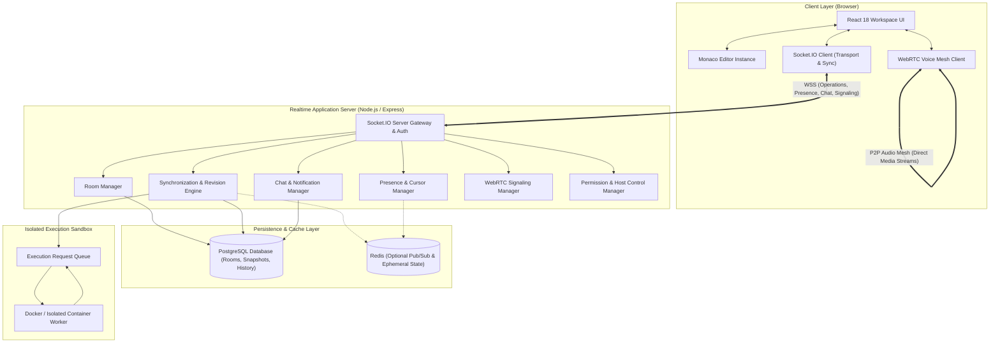
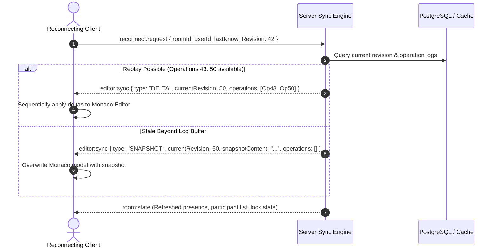
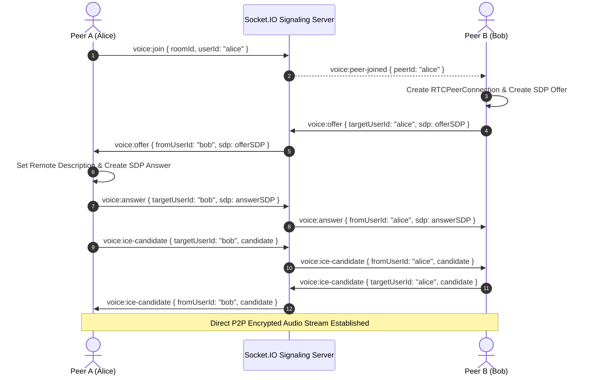
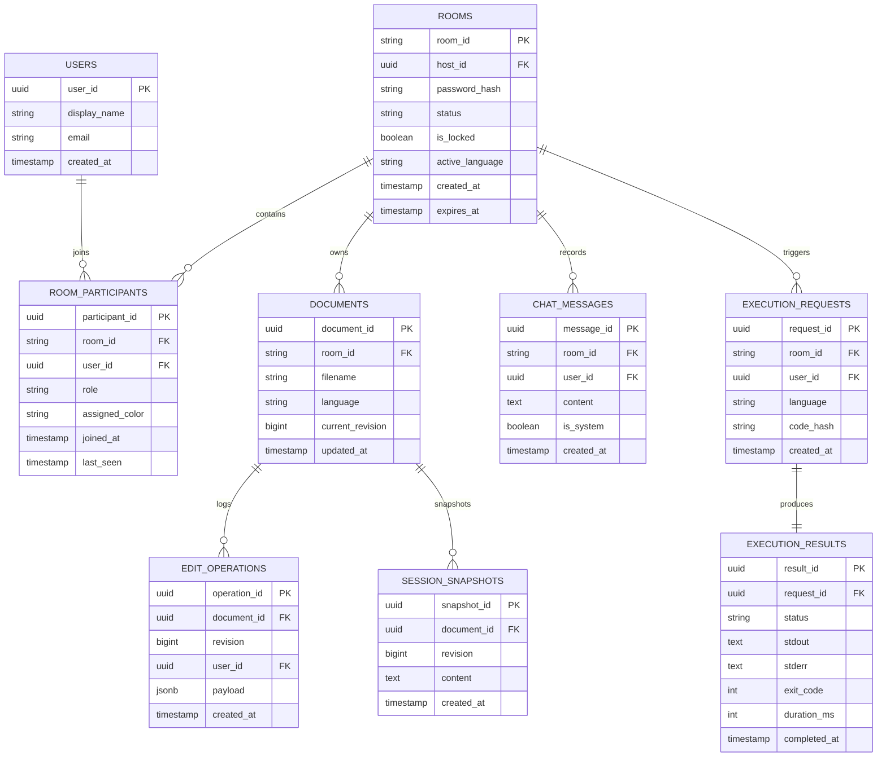
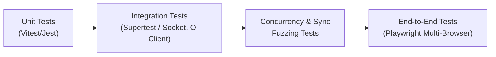

# SyncCode: Technical Requirements & System Specification

**Document Version:** 1.0.0  
**Status:** Approved Specification  
**Target Environment:** Browser-based Real-time Collaborative Code Workspace  
**Document Source:** `docs/SyncCode_Project_Blueprint.docx`  

---

## 1. Executive Summary & Problem Formulation

### 1.1 Executive Summary
**SyncCode** is a high-performance, browser-based real-time collaborative coding workspace tailored for small software engineering groups (2–5 concurrent participants). A host creates a secured, private session room and distributes a unique Room ID (and optional access password) to collaborators. Upon entering the room, all participants share a unified, synchronized Monaco-powered code editor, live cursor and selection tracking, temporary colored edit attribution, real-time presence indicators, persistent group chat, optional peer-to-peer WebRTC voice communication, and an isolated sandbox code execution engine.

SyncCode focuses strictly on **synchronous, live code collaboration**. It provides an integrated coding-focused virtual meeting space that eliminates tool fragmentation across external video calls, chat apps, and detached code editors.

### 1.2 Problem Statement
Traditional software collaboration workflows suffer from severe context fragmentation:
- Developers coordinate over external communication tools (e.g., Slack, Zoom, Google Meet) while editing code locally or asynchronously through Git.
- Screen sharing during live pair/group programming is passive: only the presenter can type, while others observe with high video latency and zero direct interactive capabilities.
- Generic shared document editors (e.g., Google Docs) lack essential developer ergonomics: syntax highlighting, auto-indentation, line numbers, multi-language support, language runtimes, and secure sandbox execution.
- Existing tools lack fine-grained live attribution: collaborators cannot intuitively see which developer modified a specific block of code moments prior without running manual Git blame queries.

SyncCode solves these challenges by embedding synchronous operation-based code synchronization, cursor awareness, visual edit attribution, low-latency communication, and secure execution into a single, cohesive web platform.

---

## 2. SyncCode vs. Git: Architectural Differentiation

SyncCode is explicitly designed as a **synchronous collaboration layer**, not a replacement for asynchronous source code version control systems like Git.

| Dimension | Git / GitHub | SyncCode |
| :--- | :--- | :--- |
| **Primary Purpose** | Asynchronous version control & history management | Synchronous real-time collaboration & pair programming |
| **Collaboration Model** | Asynchronous (pull, branch, commit, push, merge request) | Synchronous (concurrent live multi-user editing) |
| **Primary State Entity** | Commits, trees, branches, repositories | Active session rooms, documents, monotonic revisions |
| **Live Cursor / Selection**| Not supported | Supported natively with millisecond-grade updates |
| **Presence Awareness** | Commit authorship & PR review status | Real-time presence (online, typing, mic active, idle) |
| **Integrated Communication**| Asynchronous comments & PR discussions | Built-in real-time room chat and WebRTC voice mesh |
| **Conflict Resolution** | Three-way merge, rebase, merge conflicts | Server-authoritative ordered operations / deltas |
| **Access Model** | Repository permissions (read/write/admin) | Session Room ID, host permissions, capacity limits |
| **Code Execution** | CI/CD pipelines (GitHub Actions, GitLab CI) | Integrated isolated sandbox runtime returning stdout/stderr |
| **Coexistence Strategy** | SyncCode source code itself is versioned in Git; finished SyncCode sessions can export to Git repositories. |

---

## 3. Project Scope & Boundary Definitions

### 3.1 In-Scope (MVP & Phase 2)
- Private collaboration rooms restricted to 2–5 concurrent users.
- Server-authoritative delta/operation synchronization over Socket.IO WebSockets.
- Integration of Microsoft Monaco Editor with syntax highlighting for popular languages.
- Live participant cursors, text selections, and temporary fading edit attribution colors.
- Granular presence tracking (connection status, typing indicator, microphone mute/speaking state).
- Integrated text chat with XSS sanitization and system event notices (join, leave, reconnect).
- Reconnection resilience: snapshot recovery and incremental operation replay.
- Host controls: edit locking, participant ejection, room termination, and room configuration.
- Optional WebRTC peer-to-peer mesh audio voice communication for up to 5 participants.
- Isolated sandbox code execution returning execution status, stdout, stderr, and run duration.

### 3.2 Out-of-Scope (Explicitly Excluded from MVP)
- Large-scale enterprise collaboration (sessions with dozens or hundreds of concurrent users).
- Distributed Selective Forwarding Unit (SFU) audio/video infrastructure (reserved for post-MVP scale).
- Complex offline-first CRDT engines (Yjs / Automerge) for prolonged disconnected editing.
- Full cloud IDE capabilities (arbitrary extension marketplaces, language server protocols, terminal access).
- Unrestricted native execution of untrusted user binaries directly on the host application server.
- Full Git hosting / repository management replacement.

---

## 4. Functional Requirements (FR)

### FR-01: Room Creation
- **FR-01.1:** Any user can instantiate a new room with a single click or configurable parameter set.
- **FR-01.2:** System must generate a cryptographically secure, collision-resistant Room ID (e.g., nanoid or UUIDv4).
- **FR-01.3:** The creator is automatically assigned the `HOST` role with administrative privileges.
- **FR-01.4:** The room capacity is strictly capped at a maximum of 5 concurrent participants.
- **FR-01.5:** Initial document state is initialized with an empty buffer or language-specific starter template (e.g., C++, Python, JavaScript).
- **FR-01.6:** Optional room password protection can be configured by the host during creation.

### FR-02: Room Joining & Admission
- **FR-02.1:** Users enter a room by navigating to a unique shareable URL (`/room/:roomId`) or entering the Room ID on the landing page.
- **FR-02.2:** System validates room existence and active lifecycle status.
- **FR-02.3:** System verifies room capacity; if active participants count equals 5, the join request is rejected with HTTP/Socket error `ROOM_FULL`.
- **FR-02.4:** If password protection is enabled, the client must supply the password, verified via server-side hash comparison (bcrypt/argon2).
- **FR-02.5:** Upon successful admission, the server assigns the participant a unique session color from a pre-allocated distinct color palette.
- **FR-02.6:** Server emits the current room state (`room:state`) to the newly joined client, including document revision, participant roster, and room settings.
- **FR-02.7:** Server broadcasts `participant:joined` to all other active room members.

### FR-03: Real-Time Collaborative Editing
- **FR-03.1:** Participants can edit the shared code buffer inside the Monaco Editor.
- **FR-03.2:** Editor modifications are converted into discrete operation/delta payloads containing text changes, positions/ranges, and the client's base revision.
- **FR-03.3:** Edits must not broadcast full document strings over the wire; only delta operations are transmitted.
- **FR-03.4:** The server validates and orders operations, increments the authoritative document revision ($N \to N+1$), applies the change to its server-side buffer, and broadcasts the operation to all peers.
- **FR-03.5:** The generating client receives an acknowledgement (`editor:ack`) confirming acceptance and the assigned revision.
- **FR-03.6:** Clients apply remote operations non-destructively, preserving local cursor and focus positions.

### FR-04: Presence & Visual Attribution Awareness
- **FR-04.1:** Participant panel displays active room members, their assigned colors, roles (`HOST` / `MEMBER`), and online/reconnecting status.
- **FR-04.2:** Each user's cursor position (line, column) and selection range are broadcast to room peers with throttling/debouncing (30–50ms).
- **FR-04.3:** Monaco Editor renders custom cursor widgets and selection highlights matching the remote user's assigned color, complete with a floating nametag label.
- **FR-04.4:** Recent code modifications are highlighted with temporary, semi-transparent background decorations reflecting the author's color.
- **FR-04.5:** Edit highlight decorations must automatically fade out after a configurable duration (default: 3000ms) to preserve editor readability.
- **FR-04.6:** Edit attribution must not alter or break language syntax highlighting or token theme coloring.

### FR-05: Integrated Communication
- **FR-05.1:** Text chat pane allows exchanging text messages within the room.
- **FR-05.2:** Messages must display author username, assigned color, message content, and ISO timestamp.
- **FR-05.3:** System notices are posted to the chat stream for member join, member leave, edit lock toggles, and code execution triggers.
- **FR-05.4:** Input is sanitized on the server to prevent Cross-Site Scripting (XSS).
- **FR-05.5:** Optional WebRTC peer-to-peer voice channel allows audio communication among room members.
- **FR-05.6:** Voice controls include microphone mute/unmute, live speaking audio level indicators, and leave voice channel.

### FR-06: Code Execution Sandbox
- **FR-06.1:** Host or authorized participants can trigger code execution for the current active buffer.
- **FR-06.2:** Supports multiple runtime languages (e.g., Python 3, Node.js, C++, Java).
- **FR-06.3:** Code submission is routed to an isolated sandbox environment, decoupled from the core Node.js application process.
- **FR-06.4:** Sandboxed execution strictly enforces resource quotas: CPU execution time limit (default: 5s), memory limit (default: 128MB), process limit, and disabled network access.
- **FR-06.5:** Sandbox execution results (stdout, stderr, exit code, execution time in ms) are returned to the server and broadcast via `execution:result` to the room's execution output drawer.

### FR-07: Host Controls & Permissions
- **FR-07.1:** The host can toggle an `isLocked` flag to make the editor read-only for all non-host participants.
- **FR-07.2:** The host can forcefully eject any participant from the room (`participant:remove`).
- **FR-07.3:** The host can explicitly terminate the room (`room:close`), disconnecting all participants and marking room status as closed.
- **FR-07.4:** If the host disconnects, the server maintains host assignment for a configurable grace window before either promoting the next senior participant or holding state until reconnect.

### FR-08: State Persistence & Reconnection Resilience
- **FR-08.1:** Room metadata, participant rosters, and document snapshots are persisted in PostgreSQL.
- **FR-08.2:** Periodic document snapshots are taken every $K$ operations (e.g., every 50 operations) or every 60 seconds of active editing.
- **FR-08.3:** A client recovering from temporary connection loss emits `reconnect:request` with its last acknowledged revision number.
- **FR-08.4:** If the server retains operations newer than the client's revision, it replays only the missing delta operations.
- **FR-08.5:** If the client is farther behind than retained operation memory, the server transmits the latest snapshot plus trailing deltas.
- **FR-08.6:** Rooms without active participants expire after a configurable Time-To-Live (TTL) (e.g., 2 hours).

---

## 5. Non-Functional Requirements (NFR)

| ID | Category | Requirement Target | Verification Metric |
| :--- | :--- | :--- | :--- |
| **NFR-01** | **Latency** | End-to-end operation broadcast under 100ms on standard broadband networks. | Synthetic ping & delta propagation benchmarks. |
| **NFR-02** | **Consistency** | Strong eventual consistency; all active clients converge to identical buffer state at revision $N$. | Automated dual-client fuzzing & buffer hash verification. |
| **NFR-03** | **Capacity** | Strict maximum limit of 5 concurrent active participants per room; server supports 50 concurrent active rooms per node. | Load testing using headless Socket.IO clients. |
| **NFR-04** | **Security** | Zero direct execution of user code on the host OS; full input sanitization on chat & room IDs; encrypted WSS/HTTPS. | Penetration testing; command injection regression tests. |
| **NFR-05** | **Availability** | Graceful degradation on network jitter; automatic exponential backoff reconnection for Socket.IO. | Network partition & simulated disconnection tests. |
| **NFR-06** | **Resource Quotas** | Sandbox runner hard caps: 5s CPU time, 128MB RAM, 100KB stdout/stderr buffer. | Malicious submission test suite (fork bombs, infinite loops). |
| **NFR-07** | **Observability** | Structured JSON logging for all room events, operation latencies, and execution sandbox metrics. | Log inspection via correlation IDs. |
| **NFR-08** | **Usability & UX** | Desktop-optimized UI (minimum 1280x720); responsive side panels; non-blocking asynchronous editor updates. | Cross-browser testing (Chrome, Firefox, Safari, Edge). |

---

## 6. System Architecture & Component Design

### 6.1 High-Level Architecture Flow



### 6.2 Client Architecture Modules

1. **`RoomPage`**: Top-level route container coordinating view layouts, room state lifecycle, and error boundaries.
2. **`EditorPane`**: Wrapper around `@monaco-editor/react`. Manages Monaco instance creation, model buffers, language configuration, cursor position change listeners, and remote decoration layers.
3. **`ParticipantPanel`**: Renders active participant avatars, role tags, assigned colors, real-time typing indicators, and microphone mute/speaking indicators.
4. **`ChatPanel`**: Virtualized message list, system notification renderer, and sanitized message input box.
5. **`VoiceBar`**: Microphone toggle, input audio level indicator, connection state badge, and voice room disconnect button.
6. **`RoomHeader`**: Displays Room ID, quick-copy invite button, language selector dropdown, "Run Code" trigger, session export button, and connection status indicator.
7. **`ExecutionDrawer`**: Collapsible bottom panel rendering execution logs, stdout, stderr, run time, and exit status.
8. **`ConnectionManager`**: Handles Socket.IO client lifecycle, connection retry strategies, heartbeat ping-pong, and reconnection token exchanges.
9. **`CollaborationStore`**: Client-side state store maintaining:
   - Current authoritative revision number ($N$).
   - Pending local operations awaiting server ACK.
   - Remote operation queue.
   - Text mutation dispatchers.
10. **`PresenceStore`**: Manages remote cursors, active text selections, typing statuses, and ephemeral participant metadata.

### 6.3 Server Architecture Modules

1. **`modules/rooms/`**: Room lifecycle management, cryptographically secure ID generation, password validation, capacity enforcement (max 5), and TTL cleanup jobs.
2. **`modules/collaboration/`**: Server-authoritative operation intake, base revision verification, operation sequencing, revision counter incrementing, and broadcast dispatch.
3. **`modules/presence/`**: In-memory tracking of connected sockets, participant colors, cursor coordinates, and typing flags.
4. **`modules/chat/`**: Chat message validation, XSS escaping, history buffering, and room-wide emission.
5. **`modules/voice/`**: WebRTC signaling switchboard: forwards SDP `voice:offer`, `voice:answer`, and `voice:ice-candidate` packets between room peers.
6. **`modules/execution/`**: Job scheduler that validates code execution requests, enforces rate limits, invokes the isolated sandbox container, and streams results back to the room.
7. **`modules/permissions/`**: Access control guards verifying host role for actions such as `room:lock`, `participant:remove`, and `room:close`.
8. **`db/`**: PostgreSQL connection pool, schema migrations, and repository access methods.
9. **`middleware/`**: Socket authentication, payload schema validation (using Zod or Joi), security headers (Helmet), and HTTP rate limiting.

---

## 7. Real-Time Synchronization Protocol & Consistency Engine

### 7.1 Server-Authoritative Delta Synchronization Model
To prevent bandwidth exhaustion and race-condition overwrites common in full-document synchronization, SyncCode implements **Server-Authoritative Operation Delta Synchronization**:
1. The server maintains the true source-of-truth document buffer and an integer revision counter $R$, starting at $R = 0$.
2. When a client performs an edit, it generates a discrete `EditOperation` referencing its current known revision as `baseRevision`.
3. The server receives the operation and evaluates the incoming `baseRevision`:
   - **Happy Path ($baseRevision == R$):** The server increments its revision to $R + 1$, applies the edit to its internal document buffer, logs the operation in the revision history, acknowledges the sender (`editor:ack`), and broadcasts the operation to all other clients in the room (`editor:operation`).
   - **Concurrent Conflict Path ($baseRevision < R$):** The client was editing against a stale revision. The server queues or transforms the delta against intervening operations ($baseRevision + 1 \dots R$), applies the normalized change, updates $R$, and emits the rebased operation. If an unresolvable collision occurs, the server dispatches `editor:sync`, instructing the stale client to reset its buffer to the server's snapshot and re-apply pending local changes.

### 7.2 Operation Payload Data Contract

```typescript
export interface EditOperation {
  operationId: string;       // Unique UUIDv4 for deduplication & idempotency
  roomId: string;            // Target room identifier
  userId: string;            // User ID of author
  baseRevision: number;      // Revision against which the edit was performed
  clientSequence: number;    // Monotonically increasing sequence generated by client
  timestamp: number;         // Client generation timestamp (UTC epoch ms)
  range: {
    startLineNumber: number;
    startColumn: number;
    endLineNumber: number;
    endColumn: number;
  };
  rangeLength: number;       // Length of replaced text
  text: string;              // Replacement / inserted text
}
```

### 7.3 Snapshotting & Compaction Strategy
To avoid unbounded memory growth and optimize recovery:
- Every 50 operations or 60 seconds of activity, the server creates a `SessionSnapshot` record containing:
  - `snapshotId`: UUIDv4
  - `roomId`: Target room
  - `revision`: Exact revision number corresponding to the snapshot state
  - `content`: Complete serialized text buffer
  - `createdAt`: Timestamp
- Operation records older than the latest snapshot minus a safety retention window (e.g., 200 operations) can be purged from fast memory while retained in cold PostgreSQL storage for audit logs.

### 7.4 Reconnection Protocol
When a client reconnects after a network interruption:
1. Client establishes a new WebSocket connection and emits:
   ```json
   {
     "roomId": "ROOM-12345",
     "userId": "USER-987",
     "lastKnownRevision": 42
   }
   ```
2. The server compares `lastKnownRevision` against its current revision $R_{curr}$:
   - **Case A ($lastKnownRevision == R_{curr}$):** Client is completely up to date. Server returns confirmation; no text transfer needed.
   - **Case B ($lastKnownRevision < R_{curr}$ and all operations since $lastKnownRevision$ exist in memory):** Server emits `editor:sync` with an array of missed `EditOperation` objects ($43 \dots R_{curr}$). The client replays these operations sequentially in its local Monaco model.
   - **Case C ($lastKnownRevision$ is older than the oldest retained in-memory operation):** Server transmits the latest `SessionSnapshot` ($content$ at revision $R_{snap}$) followed by the subsequent operations ($R_{snap}+1 \dots R_{curr}$). Client replaces its Monaco model value and sets its local revision to $R_{curr}$.



### 7.5 Colored Edit Attribution & Live Cursors
- **Palette Management:** A deterministic palette of distinct colors (e.g., Emerald `#10B981`, Amber `#F59E0B`, Indigo `#6366F1`, Rose `#F43F5E`, Cyan `#06B6D4`) is allocated to participants upon joining.
- **Live Cursors & Selections:**
  - Cursor updates transmit `{ lineNumber, column, selection: { startLine, startCol, endLine, endCol } }`.
  - On receiving peers, Monaco `deltaDecorations` renders:
    1. A vertical colored bar matching the collaborator's color at the cursor position.
    2. A floating tooltip label displaying the author's display name.
    3. A semi-transparent overlay covering selected character ranges.
- **Temporary Edit Highlighting:**
  - When a remote edit operation is applied, Monaco applies a temporary line/range decoration with the author's color at low opacity (e.g., 15% opacity).
  - A client-side timer (3000ms) removes the decoration via a smooth CSS fade-out transition.
  - Native syntax highlighting remains completely untouched, ensuring syntax colors are never overridden.

---

## 8. Room Management, Authorization & Lifecycle

### 8.1 Room Parameters & Capacity
- **Max Capacity:** 5 concurrent active sockets per room.
- **Room ID Format:** 8–10 character alphanumeric string (e.g., `sync-k8x2-9m1a`), URL-safe, generated via cryptographically secure random bytes.
- **Access Control:**
  - Public Room: Accessible by anyone possessing the Room ID.
  - Protected Room: Requires a room password hashed via bcrypt with salt rounds $\ge 10$.

### 8.2 Role Matrix & Permissions

| Capability | HOST | MEMBER |
| :--- | :---: | :---: |
| Edit shared code buffer | Allowed (unless locked) | Allowed (unless locked) |
| Broadcast cursor & presence | Allowed | Allowed |
| Send text chat messages | Allowed | Allowed |
| Join WebRTC voice channel | Allowed | Allowed |
| Toggle Room Edit Lock (`room:lock`) | **Allowed** | Denied |
| Kick / Eject Participant (`participant:remove`)| **Allowed** | Denied |
| Change Active Code Language | **Allowed** | Denied (configurable) |
| Trigger Code Execution Sandbox | **Allowed** | Allowed (rate-limited) |
| Terminate Room Session (`room:close`) | **Allowed** | Denied |

### 8.3 Room Lifecycle States
1. **`INITIALIZING`**: Room record created in DB; waiting for host socket connection.
2. **`ACTIVE`**: Host and 0–4 participants actively connected; operational delta processing enabled.
3. **`LOCKED`**: Host has enabled edit lock; non-host incoming `editor:operation` events are rejected by the server.
4. **`SUSPENDED`**: All participants temporarily disconnected; grace timer active (TTL window: 2 hours).
5. **`CLOSED`**: Explicitly terminated by host or expired via TTL job; sockets disconnected; database record marked inactive.

---

## 9. Communication Subsystems

### 9.1 Real-Time Text Chat Engine
- **Transport:** Socket.IO events over established WebSocket connection.
- **Payload Schema:**
  ```typescript
  export interface ChatMessagePayload {
    messageId: string;
    roomId: string;
    userId: string;
    userName: string;
    userColor: string;
    content: string;
    timestamp: number;
    isSystem: boolean;
  }
  ```
- **Security & Integrity:**
  - Content length clamped to $1 \le \text{length} \le 1000$ characters.
  - Server-side HTML entity escaping to neutralize script tags and HTML injection.
  - Per-user rate limiting (max 5 messages per 3 seconds) using token bucket middleware.

### 9.2 WebRTC Peer-to-Peer Voice Mesh Engine
- **Topology:** Full Mesh P2P audio for up to 5 participants (each participant maintains $N-1 = 4$ peer connections maximum; total mesh connections across room $= \frac{N(N-1)}{2} \le 10$).
- **Signaling Channel:** Socket.IO acts as the signaling bus for:
  - `voice:join` / `voice:leave`
  - `voice:offer` (SDP Offer)
  - `voice:answer` (SDP Answer)
  - `voice:ice-candidate` (ICE Candidates)
- **STUN/TURN Configuration:** Standard public STUN servers (e.g., Google STUN `stun:stun.l.google.com:19302`) configured for NAT traversal.
- **Audio Controls:**
  - Local microphone mute/unmute via `MediaStreamTrack.enabled`.
  - Audio worklet or Web Audio API `AnalyserNode` monitoring real-time volume to broadcast `speaking:state` indicators.
  - Graceful fallback: If user denies microphone permissions, UI displays an informative alert and disables voice controls while keeping editor and chat fully operational.



---

## 10. Isolated Code Execution Architecture

### 10.1 Security Threat Model
Directly executing user-submitted code in the Node.js application process creates catastrophic security vulnerabilities:
- **Command Injection & Host Compromise:** `child_process.exec()` allows arbitrary host execution.
- **Filesystem Access:** Read/write access to application secrets, database credentials, and host files.
- **Resource Exhaustion (DoS):** Unbounded loops (`while(true)`) or memory allocation attacks crash the server.
- **Process Spawning:** Fork bombs deplete host OS process tables.

### 10.2 Sandboxing Strategy & Pipeline
To eliminate these risks, code execution is completely decoupled from the web application server:

```
[Client] 
   │ execution:request
   ▼
[Express / Socket.IO Server]
   │ 1. Validate language & code payload
   │ 2. Check rate limit (1 run / 10s per room)
   │ 3. Forward request
   ▼
[Sandbox Execution Worker / External Judge]
   │ 1. Mount code into ephemeral isolated container
   │ 2. Execute under unprivileged user ('nobody')
   │ 3. Enforce strict cgroups / ulimits
   ▼
[Execution Result]
   │ Return: { status, stdout, stderr, exitCode, durationMs }
   ▼
[Express Server]
   │ execution:result
   ▼
[All Permitted Room Clients (Output Drawer)]
```

### 10.3 Sandbox Resource Quotas & Constraints

| Parameter | Enforced Limit | Enforcement Mechanism |
| :--- | :--- | :--- |
| **CPU Time Limit** | 5.0 seconds | Linux `ulimit -t 5` or Docker `--cpus="1.0" --stop-timeout=5` |
| **Wall Clock Timeout**| 10.0 seconds | Process watchdog kill timer (`SIGKILL`) |
| **Memory Limit** | 128 MB | Docker `-m 128m --memory-swap 128m` |
| **Max Process Count** | 32 processes | Docker `--pids-limit 32` (neutralizes fork bombs) |
| **Filesystem Access** | Read-only root filesystem with ephemeral `/tmp` (max 10MB) | Docker `--read-only --tmpfs /tmp:rw,size=10m` |
| **Network Access** | Completely disabled | Docker `--network none` |
| **Output Size Cap** | Maximum 64 KB stdout/stderr buffer | Output stream truncator |
| **User Privileges** | Non-root unprivileged UID (UID 1000 or `nobody`) | Docker `--user 1000:1000` |

### 10.4 Supported MVP Language Runtimes
1. **Python 3** (`python:3.11-alpine`)
2. **JavaScript / Node.js** (`node:20-alpine`)
3. **C++ (GCC/Clang)** (`gcc:alpine`, compiled with `g++ -O2 -std=c++17 main.cpp`)
4. **Java** (`openjdk:17-alpine`)

---

## 11. Database Schema & Data Models

### 11.1 Relational Entity Relationship Diagram



### 11.2 PostgreSQL DDL & Indexing Strategy

```sql
-- Enable UUID extension
CREATE EXTENSION IF NOT EXISTS "uuid-ossp";

-- 1. Users Table
CREATE TABLE users (
    user_id UUID PRIMARY KEY DEFAULT uuid_generate_v4(),
    display_name VARCHAR(64) NOT NULL,
    email VARCHAR(255) UNIQUE,
    created_at TIMESTAMPTZ NOT NULL DEFAULT NOW()
);

-- 2. Rooms Table
CREATE TABLE rooms (
    room_id VARCHAR(32) PRIMARY KEY,
    host_id UUID NOT NULL REFERENCES users(user_id) ON DELETE CASCADE,
    password_hash VARCHAR(255),
    status VARCHAR(20) NOT NULL DEFAULT 'ACTIVE', -- ACTIVE, LOCKED, CLOSED
    is_locked BOOLEAN NOT NULL DEFAULT FALSE,
    active_language VARCHAR(32) NOT NULL DEFAULT 'javascript',
    created_at TIMESTAMPTZ NOT NULL DEFAULT NOW(),
    expires_at TIMESTAMPTZ NOT NULL
);
CREATE INDEX idx_rooms_status ON rooms(status);
CREATE INDEX idx_rooms_expires_at ON rooms(expires_at);

-- 3. Room Participants
CREATE TABLE room_participants (
    participant_id UUID PRIMARY KEY DEFAULT uuid_generate_v4(),
    room_id VARCHAR(32) NOT NULL REFERENCES rooms(room_id) ON DELETE CASCADE,
    user_id UUID NOT NULL REFERENCES users(user_id) ON DELETE CASCADE,
    role VARCHAR(20) NOT NULL DEFAULT 'MEMBER', -- HOST, MEMBER
    assigned_color VARCHAR(16) NOT NULL,
    joined_at TIMESTAMPTZ NOT NULL DEFAULT NOW(),
    last_seen TIMESTAMPTZ NOT NULL DEFAULT NOW(),
    CONSTRAINT uq_room_user UNIQUE (room_id, user_id)
);
CREATE INDEX idx_participants_room_id ON room_participants(room_id);

-- 4. Documents Table
CREATE TABLE documents (
    document_id UUID PRIMARY KEY DEFAULT uuid_generate_v4(),
    room_id VARCHAR(32) NOT NULL REFERENCES rooms(room_id) ON DELETE CASCADE,
    filename VARCHAR(255) NOT NULL DEFAULT 'main.js',
    language VARCHAR(32) NOT NULL DEFAULT 'javascript',
    current_revision BIGINT NOT NULL DEFAULT 0,
    updated_at TIMESTAMPTZ NOT NULL DEFAULT NOW(),
    CONSTRAINT uq_room_document UNIQUE (room_id, filename)
);
CREATE INDEX idx_documents_room_id ON documents(room_id);

-- 5. Edit Operations Log
CREATE TABLE edit_operations (
    operation_id UUID PRIMARY KEY,
    document_id UUID NOT NULL REFERENCES documents(document_id) ON DELETE CASCADE,
    revision BIGINT NOT NULL,
    user_id UUID NOT NULL REFERENCES users(user_id),
    payload JSONB NOT NULL,
    created_at TIMESTAMPTZ NOT NULL DEFAULT NOW(),
    CONSTRAINT uq_doc_revision UNIQUE (document_id, revision)
);
CREATE INDEX idx_operations_doc_revision ON edit_operations(document_id, revision);

-- 6. Session Snapshots
CREATE TABLE session_snapshots (
    snapshot_id UUID PRIMARY KEY DEFAULT uuid_generate_v4(),
    document_id UUID NOT NULL REFERENCES documents(document_id) ON DELETE CASCADE,
    revision BIGINT NOT NULL,
    content TEXT NOT NULL,
    created_at TIMESTAMPTZ NOT NULL DEFAULT NOW()
);
CREATE INDEX idx_snapshots_doc_revision ON session_snapshots(document_id, revision DESC);

-- 7. Chat Messages
CREATE TABLE chat_messages (
    message_id UUID PRIMARY KEY DEFAULT uuid_generate_v4(),
    room_id VARCHAR(32) NOT NULL REFERENCES rooms(room_id) ON DELETE CASCADE,
    user_id UUID REFERENCES users(user_id) ON DELETE SET NULL,
    content TEXT NOT NULL,
    is_system BOOLEAN NOT NULL DEFAULT FALSE,
    created_at TIMESTAMPTZ NOT NULL DEFAULT NOW()
);
CREATE INDEX idx_chat_room_created ON chat_messages(room_id, created_at ASC);

-- 8. Execution Requests & Results
CREATE TABLE execution_requests (
    request_id UUID PRIMARY KEY DEFAULT uuid_generate_v4(),
    room_id VARCHAR(32) NOT NULL REFERENCES rooms(room_id) ON DELETE CASCADE,
    user_id UUID NOT NULL REFERENCES users(user_id),
    language VARCHAR(32) NOT NULL,
    code_hash VARCHAR(64) NOT NULL,
    created_at TIMESTAMPTZ NOT NULL DEFAULT NOW()
);

CREATE TABLE execution_results (
    result_id UUID PRIMARY KEY DEFAULT uuid_generate_v4(),
    request_id UUID NOT NULL UNIQUE REFERENCES execution_requests(request_id) ON DELETE CASCADE,
    status VARCHAR(20) NOT NULL, -- SUCCESS, TIMEOUT, MEMORY_EXCEEDED, ERROR
    stdout TEXT,
    stderr TEXT,
    exit_code INT,
    duration_ms INT,
    completed_at TIMESTAMPTZ NOT NULL DEFAULT NOW()
);
```

### 11.3 Ephemeral State Management (Redis or In-Memory)
- **Cursor & Selection State:** Ephemeral coordinates (`lineNumber`, `column`, `selectionRange`) are stored in an in-memory hash or Redis with an automatic TTL of 10 seconds. Not persisted in PostgreSQL to avoid write amplification.
- **Heartbeat & Online Tracking:** Socket connection IDs map to participant records. Ping heartbeats refresh the online key every 5 seconds.

---

## 12. Socket.IO Events & Network API Specifications

### 12.1 Socket.IO Real-Time Event Catalog

| Event Name | Direction | Payload Contract | Description |
| :--- | :---: | :--- | :--- |
| `room:create` | Client $\to$ Server | `{ displayName: string, password?: string, language?: string }` | Requests room creation. |
| `room:join` | Client $\to$ Server | `{ roomId: string, displayName: string, password?: string }` | Requests admission to an existing room. |
| `room:state` | Server $\to$ Client | `{ room: RoomData, document: DocState, participants: User[], revision: number }` | Initial synchronized payload sent upon joining. |
| `room:leave` | Client $\to$ Server | `{ roomId: string }` | Gracefully departs the active room. |
| `room:lock` | Host $\to$ Server | `{ roomId: string, isLocked: boolean }` | Toggles read-only editor state. |
| `room:close` | Host $\to$ Server | `{ roomId: string }` | Host closes and terminates the room session. |
| `participant:joined` | Server $\to$ Room | `{ participant: RoomParticipant }` | Notifies peers that a new user joined. |
| `participant:left` | Server $\to$ Room | `{ userId: string, reason: string }` | Notifies peers that a user left or disconnected. |
| `participant:remove`| Host $\to$ Server | `{ roomId: string, targetUserId: string }` | Host ejects a specific participant. |
| `editor:operation` | Client $\to$ Server | `EditOperation` | Client submits an editor delta modification. |
| `editor:operation` | Server $\to$ Room | `EditOperation & { revision: number }` | Server broadcasts accepted delta to peers. |
| `editor:ack` | Server $\to$ Client | `{ operationId: string, revision: number }` | Server acknowledges operation acceptance. |
| `editor:sync` | Server $\to$ Client | `{ type: "DELTA" \| "SNAPSHOT", revision: number, operations?: EditOperation[], content?: string }` | Forces full state resynchronization. |
| `cursor:update` | Client $\to$ Server | `{ position: { lineNumber: number, column: number }, selection: Range }` | Client sends local cursor/selection changes. |
| `cursor:broadcast` | Server $\to$ Room | `{ userId: string, position: Position, selection: Range }` | Broadcasts collaborator cursor position. |
| `presence:typing` | Client $\to$ Server | `{ isTyping: boolean }` | Indicates user is actively editing. |
| `presence:update` | Server $\to$ Room | `{ userId: string, status: "ONLINE" \| "IDLE" \| "RECONNECTING" }` | Broadcasts user connection status changes. |
| `chat:send` | Client $\to$ Server | `{ content: string }` | Dispatches new chat message. |
| `chat:message` | Server $\to$ Room | `ChatMessagePayload` | Emits validated chat message to room. |
| `voice:join` | Client $\to$ Server | `{ roomId: string }` | Informs room that user entered voice channel. |
| `voice:offer` | Client $\leftrightarrow$ Server | `{ targetUserId: string, sdp: RTCSessionDescriptionInit }` | Relays WebRTC SDP Offer. |
| `voice:answer` | Client $\leftrightarrow$ Server | `{ targetUserId: string, sdp: RTCSessionDescriptionInit }` | Relays WebRTC SDP Answer. |
| `voice:ice` | Client $\leftrightarrow$ Server | `{ targetUserId: string, candidate: RTCIceCandidateInit }` | Relays WebRTC ICE candidate. |
| `execution:request`| Client $\to$ Server | `{ language: string, code: string }` | Submits code for sandbox execution. |
| `execution:result` | Server $\to$ Room | `{ status: string, stdout: string, stderr: string, durationMs: number, exitCode: number }` | Broadcasts execution results to room. |
| `reconnect:request`| Client $\to$ Server | `{ roomId: string, userId: string, lastKnownRevision: number }` | Requests state recovery after reconnection. |

### 12.2 REST API Endpoints

```
POST   /api/v1/rooms             - Create a new room (returns roomId, sessionToken)
GET    /api/v1/rooms/:id/verify  - Verify room existence, capacity, password requirement
GET    /api/v1/rooms/:id/export  - Export current buffer as a downloadable code file
GET    /api/v1/health            - Health check (service status, DB connectivity, uptime)
```

---

## 13. UI / UX Design & Layout Specifications

### 13.1 Workspace Layout Diagram

```
+-----------------------------------------------------------------------------------------+
| [SyncCode Logo]  Room: sync-k8x2  [Copy Invite]  Language: [C++ v]  [ Run Code ]  (o) 4/5 |
+-----------------------------------+----------------------------------+------------------+
| COLLABORATORS (4)                 | monaco-editor-pane               | ROOM CHAT        |
|-----------------------------------|----------------------------------|------------------|
| (*) Alice (Host)   [Mic: On]  (#) | 1  #include <iostream>           | [System]         |
| ( ) Bob            [Mic: Mute](#) | 2  using namespace std;          | Bob joined.      |
| ( ) Charlie        [Mic: On]  (#) | 3                                |                  |
| ( ) Dana           [No Mic]   (#) | 4  int main() {                  | Alice:           |
|                                   | 5     cout << "Hello SyncCode!"; | Let's fix line 5 |
|                                   | 6     return 0;                  |                  |
|                                   | 7  }                             | Charlie:         |
|                                   |                                  | On it!           |
|                                   |                                  |                  |
|                                   |                                  |                  |
+-----------------------------------+----------------------------------|------------------+
| [Mute Mic] [Leave Voice]          | Revision: 142 | UTF-8 | Spaces: 2| [Type message...] |
+-----------------------------------+----------------------------------+------------------+
| EXECUTION OUTPUT DRAWER (Stdout / Stderr / Exit Status: 0 / 42ms)                        |
| Hello SyncCode!                                                                         |
+-----------------------------------------------------------------------------------------+
```

### 13.2 Visual Component Directives
1. **Top Bar:** Houses brand logo, room identity with copy-to-clipboard button, language selector, primary "Run Code" execution trigger button, export button, and a visual room occupancy counter (`N/5`).
2. **Left Panel (Participant Roster):** Renders vertical participant cards with avatars, host crown badge, presence indicators (green dot for online, amber for reconnecting), microphone mute status, and real-time audio wave pulses.
3. **Center Area (Editor):** Monaco Editor configured with dark theme (`vs-dark`), code minimap enabled, inline participant cursor ribbons, and fading highlight decorations.
4. **Right Panel (Chat):** Chronological, virtualized chat log with author color identifiers and message time tags. Includes sticky input box with character counter ($1000$ max).
5. **Bottom Bar:** Status strip rendering document revision ($R$), line and column position, encoding, and sync health badge (`Synced`, `Syncing...`, `Disconnected`).
6. **Execution Output Drawer:** Slide-up terminal drawer rendering code run status, formatted stdout (green/white), stderr (red), return code, and execution time metrics.

---

## 14. Project Directory & File Layout

```
sync-code/
├── client/
│   ├── public/
│   │   ├── index.html
│   │   └── favicon.ico
│   ├── src/
│   │   ├── assets/
│   │   ├── components/
│   │   │   ├── common/           # Buttons, modals, input elements, badges
│   │   │   ├── layout/           # Header, status bar, side panels, drawer
│   │   │   ├── participants/     # ParticipantList, AvatarBadge, MicIndicator
│   │   │   ├── chat/             # ChatBox, ChatMessageItem, ChatInput
│   │   │   └── execution/        # OutputDrawer, TerminalView
│   │   ├── editor/
│   │   │   ├── MonacoWrapper.tsx # Monaco lifecycle and configuration
│   │   │   ├── cursorDecorations.ts # Remote cursor & selection manager
│   │   │   ├── attributionDecorations.ts # Fading colored edit decorations
│   │   │   └── editorKeybindings.ts
│   │   ├── collaboration/
│   │   │   ├── SyncManager.ts    # Client-side delta dispatch & reconciliation
│   │   │   ├── OperationQueue.ts # Local pending operation buffer
│   │   │   └── ReconnectHandler.ts
│   │   ├── voice/
│   │   │   ├── WebRTCManager.ts  # RTCPeerConnection mesh orchestration
│   │   │   └── audioUtils.ts     # AnalyserNode audio level computation
│   │   ├── hooks/
│   │   │   ├── useSocket.ts
│   │   │   ├── useMonaco.ts
│   │   │   ├── usePresence.ts
│   │   │   └── useVoice.ts
│   │   ├── state/
│   │   │   ├── roomStore.ts      # Zustand / Context state store
│   │   │   ├── editorStore.ts
│   │   │   └── chatStore.ts
│   │   ├── pages/
│   │   │   ├── LandingPage.tsx   # Create / Join room view
│   │   │   └── RoomPage.tsx      # Main collaborative workspace
│   │   ├── services/
│   │   │   ├── api.ts            # Axios / Fetch HTTP client
│   │   │   └── socket.ts         # Socket.IO client singleton
│   │   ├── App.tsx
│   │   └── index.tsx
│   ├── package.json
│   └── tsconfig.json
│
├── server/
│   ├── src/
│   │   ├── modules/
│   │   │   ├── rooms/            # Room creation, validation, TTL, capacity
│   │   │   ├── collaboration/    # Operation sequencing, delta validation, sync
│   │   │   ├── presence/         # Cursor coordinates, typing flags, roster
│   │   │   ├── chat/             # Message validation, sanitization, dispatch
│   │   │   ├── voice/            # WebRTC SDP/ICE signaling router
│   │   │   ├── execution/        # Sandbox client, quota enforcement, runners
│   │   │   └── permissions/      # Role checks (HOST vs MEMBER)
│   │   ├── db/
│   │   │   ├── index.ts          # PostgreSQL pool connection
│   │   │   ├── migrations/       # SQL migration scripts
│   │   │   └── repositories/     # Data access layer (RoomRepo, DocumentRepo, etc.)
│   │   ├── middleware/
│   │   │   ├── rateLimiter.ts    # Express & Socket rate limiters
│   │   │   ├── errorHandler.ts   # Centralized error middleware
│   │   │   └── validation.ts     # Zod payload validation schemas
│   │   ├── config/
│   │   │   └── env.ts            # Environment variables & constants
│   │   ├── server.ts             # Express & HTTP server instantiation
│   │   └── socket.ts             # Socket.IO gateway initialization
│   ├── package.json
│   └── tsconfig.json
│
├── shared/
│   ├── events/
│   │   └── socketEvents.ts       # Shared Socket.IO event name constants
│   ├── types/
│   │   ├── operations.ts         # EditOperation, Delta types
│   │   ├── room.ts               # Room, Participant, Role types
│   │   ├── presence.ts           # Cursor, Selection, Presence types
│   │   ├── chat.ts               # Chat message contracts
│   │   └── execution.ts          # Execution request and result contracts
│   └── constants/
│       └── colorPalette.ts       # Distinct user color hex codes
│
├── runner/                       # Sandbox worker runner (Docker or Judge adapter)
│   ├── Dockerfile
│   ├── run.sh
│   └── languages/
│
├── tests/
│   ├── unit/                     # Unit tests for operations, validation, sync
│   ├── integration/              # Socket.IO event integration tests
│   └── e2e/                      # Playwright multi-client concurrency tests
│
├── docs/
│   ├── SyncCode_Project_Blueprint.docx
│   └── PROJECT_SPEC.md
├── .env.example
├── docker-compose.yml
└── README.md
```

---

## 15. Security & Threat Mitigation Architecture

1. **Transport Security:** All web traffic must strictly enforce HTTPS (TLS 1.3), and all real-time WebSocket traffic must use WSS. Strict Transport Security (HSTS) headers are configured via Helmet.
2. **Cryptographic Integrity:**
   - Room IDs are generated using cryptographically strong pseudo-random generators (`crypto.randomBytes`).
   - Room passwords are never stored in plaintext; hashed using `bcrypt` (cost factor 10).
3. **Payload Sanitization & Injection Defense:**
   - Chat input is sanitized on the server before storage or broadcast to prevent Stored XSS.
   - All client socket payloads are strictly validated using `Zod` schemas. Malformed payloads result in immediate socket drops.
   - Client-supplied identity assertions (`userId`, `role`) are rejected. Identity is verified against the validated session token attached during the initial handshake.
4. **Execution Sandbox Hardening:**
   - No direct shell execution via `child_process.exec(userInput)`.
   - Code runs in isolated Docker containers with read-only root filesystems, `--network none`, drop-all capabilities (`--cap-drop ALL`), non-root execution user, and hard CPU/RAM limits.
5. **Rate Limiting & DoS Prevention:**
   - Socket connection throttle: Max 10 connections/min per IP.
   - Edit operations throttle: Max 60 operations/sec per socket.
   - Code execution throttle: Max 1 execution request every 10 seconds per room.
   - Chat throttle: Max 5 messages every 3 seconds per user.

---

## 16. Comprehensive Testing Strategy & Concurrency Scenarios



### 16.1 Testing Categories & Matrix

| Test Category | Target Scope | Execution Method | Pass Criteria |
| :--- | :--- | :--- | :--- |
| **Unit Testing** | Operation validation, delta calculations, revision increment, password hashing. | Vitest / Jest | 100% logic coverage on sync & auth utils. |
| **Integration Testing**| Socket.IO connection, room join/leave lifecycle, chat broadcasting, DB queries. | Node test runner + in-memory Postgres | Events trigger expected database mutations and socket emissions. |
| **Concurrency Fuzzing**| Two or more clients simultaneously submitting operations to overlapping document ranges. | Headless multi-socket runner | Server produces deterministic ordering; all clients converge to identical buffer. |
| **Reconnection Verification**| Client disconnects, peer edits 5 times, client reconnects with stale revision. | Simulated socket disconnect | Client correctly requests and applies delta replays up to latest revision. |
| **Capacity Enforcement**| Sixth client attempts to join a full 5-user room. | Socket connection test | Connection rejected with `ROOM_FULL` error code. |
| **Security Validation**| Client attempts to execute malicious fork bomb or access host filesystem (`/etc/passwd`). | Sandbox test suite | Sandbox execution times out within 5s; zero host leakage. |
| **E2E Browser Test** | Full workflow: Room creation $\to$ 4 users join $\to$ collaborative typing $\to$ execution. | Playwright (4 headless Chromium instances) | Final editor contents and execution output match across all 4 browser contexts. |

---

## 17. Phased Implementation Roadmap

```mermaid
gantt
    title SyncCode Implementation Roadmap
    dateFormat  X
    axisFormat Phase %X
    section Core Infrastructure
    Phase 0 - Blueprint & Spec Approval      :active, p0, 0, 1
    Phase 1 - Project Scaffold & Stack Setup :p1, after p0, 1
    Phase 2 - Room Lifecycle & Capacity      :p2, after p1, 1
    section Collaboration Engine
    Phase 3 - Monaco Editor Integration      :p3, after p2, 1
    Phase 4 - Server-Authoritative Sync      :p4, after p3, 2
    Phase 5 - Cursors & Fading Edit Colors   :p5, after p4, 1
    section Communication & Durability
    Phase 6 - Text Chat & System Notices     :p6, after p5, 1
    Phase 7 - Snapshots & Reconnect Recovery :p7, after p6, 1
    section Advanced Modules & Polish
    Phase 8 - WebRTC P2P Voice Mesh          :p8, after p7, 2
    Phase 9 - Isolated Sandbox Code Runner   :p9, after p8, 2
    Phase 10 - Security Audit, Tests & Deploy:p10, after p9, 1
```



- **Phase 0: Specifications & Architectural Blueprint**
  - Finalize `docs/PROJECT_SPEC.md` and complete technical alignment.
- **Phase 1: Project Scaffolding & Environment Setup**
  - Initialize monorepo (`client`, `server`, `shared`), TypeScript configurations, Tailwind CSS, Express, and Socket.IO boilerplate.
- **Phase 2: Room Management & Membership Engine**
  - Implement room creation, secure ID generation, password validation, capacity clamping (max 5), and join/leave handlers.
- **Phase 3: Monaco Editor Integration**
  - Embed Monaco Editor in React, configure theme, syntax highlighting, and local change listeners.
- **Phase 4: Real-Time Synchronization Engine**
  - Build delta generation on client, server revisioning pipeline, operation broadcast, and ACK handling.
- **Phase 5: Live Cursors, Selections & Colored Attribution**
  - Implement cursor tracking, selection decorations, and fading temporary background highlights with author colors.
- **Phase 6: Room Communication & Chat**
  - Build chat UI, server-side XSS escaping, rate-limiting, and system join/leave notifications.
- **Phase 7: Persistence & Reconnection Resilience**
  - PostgreSQL schema migrations, periodic snapshotting, delta replay logic on `reconnect:request`.
- **Phase 8: WebRTC Voice Communication**
  - Establish peer-to-peer audio mesh, Socket.IO signaling, mute/unmute controls, and speaking indicator bars.
- **Phase 9: Sandbox Code Execution Engine**
  - Implement isolated runner (Docker container worker), resource limits, timeout enforcement, and output drawer UI.
- **Phase 10: Security Hardening, End-to-End Testing & Deployment**
  - Conduct full security review, rate-limit audit, Playwright concurrency tests, and deploy to production hosting.

---

## 18. Technical Defense & Viva Reference Guide

### Q1: Why is SyncCode NOT a Git replacement?
**Answer:** Git is an **asynchronous version control system** designed for distributed commit histories, branching, code reviews, and offline tracking. SyncCode is a **synchronous live collaboration layer** designed for real-time presence, shared cursor awareness, active pair programming, and instant code execution in small teams. SyncCode operates at the active coding session layer; Git operates at the project repository history layer.

### Q2: Why choose Socket.IO instead of raw WebSockets?
**Answer:** While raw WebSockets provide basic byte/text streaming, Socket.IO provides vital production abstractions: built-in room multiplexing, event-based RPC with request acknowledgements, automatic heartbeats, and robust reconnection mechanics with buffering out of the box. This drastically reduces boilerplate while ensuring high reliability.

### Q3: Why avoid whole-document synchronization on every keystroke?
**Answer:** Sending entire document strings introduces severe network bandwidth bloat ($O(N \times \text{doc\_length})$ per keystroke) and creates fatal last-write-wins race conditions where one user's modification clobbers another's. Delta-based operation synchronization transmits only affected ranges, enabling server serialization and precise non-destructive updates.

### Q4: How does the server resolve concurrent edits without complex CRDTs in the MVP?
**Answer:** The server acts as the single source of truth using a **monotonically increasing revision counter**. Operations are processed sequentially through a server-side queue. When an operation based on an older revision arrives, the server either transforms the range against intervening accepted operations or prompts an `editor:sync` reconciliation, ensuring every client converges to the exact server buffer state.

### Q5: How is colored edit attribution implemented without breaking syntax highlighting?
**Answer:** Source code text itself is never decorated with styling tags or HTML. Instead, Monaco's non-destructive `deltaDecorations` API applies CSS background highlights and glyph margins to editor line/column ranges. These decorations are purely client-side visual overlays that automatically fade out after 3 seconds, keeping language syntax tokens intact.

### Q6: Why use WebRTC for voice instead of streaming audio over Socket.IO?
**Answer:** Socket.IO runs over TCP, which guarantees lossless in-order packet delivery via retransmissions. Audio over TCP suffers from severe latency spikes and head-of-line blocking under packet loss. WebRTC uses UDP (RTP/SRTP), which prioritizes real-time delivery over perfect packet recovery, providing sub-100ms ultra-low latency voice communication. Socket.IO is used exclusively for signaling.

### Q7: Why must code execution never run directly inside Node.js `child_process`?
**Answer:** Running untrusted client code directly on the host machine enables arbitrary remote code execution (RCE). A malicious user could execute system commands (`rm -rf /`, reading `.env` secrets), run fork bombs to crash the OS, or execute port scans. SyncCode isolates execution in a disposable sandbox container with zero network access, read-only filesystems, and strict CPU/memory limits.

---

**End of Specification Document**
