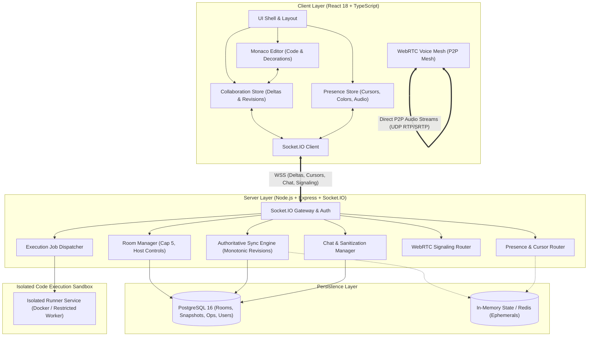
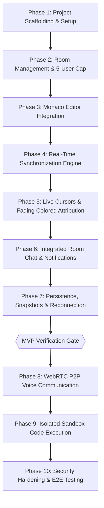

# SyncCode: Comprehensive Implementation Plan & Technical Architecture

**Document Version:** 1.0.0  
**Lead Architect:** Antigravity  
**Target Project:** SyncCode — Real-Time Collaborative Code Workspace  
**Status:** Approved for Implementation  
**Reference Documents:**  
- [AGENTS.md](file:///c:/Users/Lokesh/Downloads/CODEPULSE/AGENTS.md)
- [docs/PROJECT_SPEC.md](file:///c:/Users/Lokesh/Downloads/CODEPULSE/docs/PROJECT_SPEC.md)
- [docs/SyncCode_Project_Blueprint.docx](file:///c:/Users/Lokesh/Downloads/CODEPULSE/docs/SyncCode_Project_Blueprint.docx)

---

## 1. Executive Inspection & Workspace Baseline

### 1.1 Environment Analysis
- **Operating System:** Windows (PowerShell Shell)
- **Node.js Runtime:** `v22.16.0` (LTS-class modern runtime with native fetch, WebStreams, and ESM support)
- **Package Manager:** `npm 10.9.2`
- **Python Engine:** `Python 3.14.3` (available for script tooling / sandbox execution mock)
- **Git State:** Fresh workspace (`fatal: not a git repository`), ready for Git initialization as project version control.

### 1.2 Current Directory State
```
CODEPULSE/
├── AGENTS.md                          # Core architectural rules & boundary constraints
└── docs/
    ├── PROJECT_SPEC.md                # Full technical specification & functional requirements
    └── SyncCode_Project_Blueprint.docx # Original project blueprint source
```

### 1.3 Project Identity & Non-Goals
- **Identity:** SyncCode is a synchronous, real-time pair and small-group coding workspace (strictly 2–5 users per room).
- **Explicit Non-Goal:** SyncCode is **NOT** a Git replacement. No commits, branches, pull requests, merges, or repository hosting will be implemented as collaboration mechanisms. Git is reserved solely for maintaining SyncCode’s own codebase and optional future session exports.

---

## 2. Architecture & Subsystem Analysis

SyncCode follows a decoupled client-server architecture with four primary layers:



### Subsystem Breakdown:
1. **Frontend Client (`client/`):** Single-page application built with React 18, Vite, TypeScript, and Tailwind CSS. Employs Microsoft Monaco Editor (`@monaco-editor/react`) for desktop-grade editing. Custom CSS/Monaco decoration controllers manage live cursors, remote selection bounding boxes, and transient fading colored edit attribution.
2. **Backend Server (`server/`):** Modular Node.js / Express application hosting the Socket.IO WebSocket gateway. Coordinates monotonic revision ordering, delta validations, presence broadcasts, and WebRTC signaling.
3. **Shared Contract Module (`shared/`):** Contains TypeScript definitions, Zod validation schemas, Socket.IO event name constants, and color palette configurations shared verbatim between frontend and backend.
4. **Data Persistence (`PostgreSQL`):** Durable storage for user profiles, room configurations, document snapshots, delta audit trails, and session transcripts. In-memory data structures handle ephemeral cursor positions and debounce buffers.
5. **Execution Runner (`runner/`):** An isolated sandbox execution microservice enforcing strict cgroup ulimits (5s CPU timeout, 128MB RAM, 32 process cap, read-only root filesystem, zero network access).

---

## 3. Dependency Identification & Stack Selection

To keep the application lean and strictly prevent unnecessary dependencies, the stack is carefully selected:

### 3.1 Shared Dependencies (`shared/`)
- `zod` (`^3.23.8`): Schema validation for delta operations, room parameters, and network packets.
- `typescript` (`^5.5.0`): Type-level contract safety between client and server.

### 3.2 Frontend Dependencies (`client/`)
- **Core:** `react` (`^18.3.1`), `react-dom` (`^18.3.1`), `react-router-dom` (`^6.26.0`)
- **Editor:** `@monaco-editor/react` (`^4.6.0`), `monaco-editor` (`^0.50.0`)
- **Real-Time Client:** `socket.io-client` (`^4.7.5`)
- **State Management:** `zustand` (`^4.5.4`) — minimalist, hook-based, high performance with no boilerplate.
- **Styling & UI:** `tailwindcss` (`^3.4.7`), `lucide-react` (`^0.414.0`) (lightweight SVG icons), `clsx`, `tailwind-merge`
- **Build Tool:** `vite` (`^5.3.4`), `@vitejs/plugin-react` (`^4.3.1`)

### 3.3 Backend Dependencies (`server/`)
- **Core Framework:** `express` (`^4.19.2`), `cors` (`^2.8.5`), `helmet` (`^7.1.0`), `dotenv` (`^16.4.5`)
- **Real-Time Gateway:** `socket.io` (`^4.7.5`)
- **Database & Data Access:** `pg` (`^8.12.0`) (native PostgreSQL client with connection pooling)
- **Security & Cryptography:** `bcrypt` (`^5.1.1`), `nanoid` (`^5.0.7`) (cryptographically secure room IDs)
- **Dev & Build:** `tsx` (`^4.16.2`) (zero-config TypeScript execution for Node 22), `vitest` (`^2.0.4`), `supertest` (`^7.0.0`)

### 3.4 Execution Runner Dependencies (`runner/`)
- Isolated container environment using standard Alpine Linux images (`python:3.11-alpine`, `node:20-alpine`, `gcc:alpine`, `openjdk:17-alpine`) invoked via Docker API or an isolated Node.js child runner with OS sandboxing flags (`ulimit`, `bwrap`, or containerized runner).

---

## 4. Minimum Viable Product (MVP) Definition

Adhering strictly to the **AGENTS.md rule: "Build incrementally. Do not implement all features in one step."**, the project is partitioned into distinct development milestones:

```
[ MVP: Core Collaboration Engine ]
  ├── 1. Project Monorepo & TypeScript Scaffolding
  ├── 2. Private Rooms (Capacity: 5, Cryptographic Room ID, Host controls)
  ├── 3. Monaco Editor Integration with Syntax Highlighting
  ├── 4. Server-Authoritative Delta/Operation Synchronization (Revision N -> N+1)
  ├── 5. Live Multi-User Cursors, Selections, and Nametags
  ├── 6. Colored Edit Attribution (Temporary fading highlights)
  ├── 7. Integrated Room Chat (XSS sanitized, timestamps, system notices)
  └── 8. State Persistence, Snapshots & Reconnection Resilience
               │
               ▼
[ Phase 2: Rich Media & Code Execution ]
  ├── 9. WebRTC Peer-to-Peer Mesh Voice Communication (Mute/Unmute, Speaking Bars)
  └── 10. Isolated Sandbox Code Execution Runner (Python, JS, C++, limits)
               │
               ▼
[ Post-MVP / Production Hardening ]
  ├── 11. Multi-file Tabs & File Tree
  ├── 12. Redis Adapter for Multi-Node Scaling
  └── 13. Session Export (Download as .zip or export to GitHub)
```

### MVP Acceptance Gate
Before starting Phase 2 (Voice and Code Execution), the MVP must demonstrate:
1. Two to five independent browser windows concurrently editing the same buffer.
2. Deterministic convergence with zero document overwrites.
3. Proper cursor tracking and distinct author colors.
4. Fading edit highlights that do not corrupt syntax highlighting.
5. Instant reconnection recovering the exact server revision.
6. Absolute rejection of the 6th participant entering a full room.

---

## 5. Technical Risks & Mitigation Strategies

| Risk Category | Technical Hazard | Impact | Mitigation Strategy |
| :--- | :--- | :--- | :--- |
| **Sync Race Conditions** | Two clients send edits simultaneously based on the same revision $N$. | Silent code overwrite or divergence across clients. | **Server-Authoritative Linearization:** Edits enter a serialized server queue. The first operation establishes revision $N+1$. Stale operations ($baseRevision < currentRevision$) are either range-transformed or trigger an instant `editor:sync` reconciliation. |
| **Monaco Decoration Drift** | Remote edits shift line/column offsets, causing cursor and highlight decorations to point to wrong text. | Visual glitching; decorations displayed over incorrect characters. | Use Monaco's native `TrackedRanges` decoration stickiness (`Stickiness.AlwaysGrowsWhenTypingAtEdges`) and re-index active decoration ranges upon receiving delta operations. |
| **Monaco Echo Loops** | Applying remote operations triggers Monaco's `onDidChangeModelContent` event, generating infinite delta feedback loops. | Stack overflow / network saturation crash. | Implement an `isApplyingRemoteEdit` execution guard flag in `SyncManager`. Suppress outbound socket emission when mutations originate from remote deltas. |
| **Voice Mesh Scalability** | P2P WebRTC mesh bandwidth scales quadratically ($O(N^2)$). | Audio stuttering, CPU spikes on low-end machines. | Strictly cap room capacity at 5 participants ($4$ peer connections per client, $10$ total audio streams across room). Limit audio tracks to mono 32kbps Opus codec. |
| **Sandbox Breakout / DoS** | Malicious user submits fork bombs, infinite memory allocation, or filesystem deletion commands. | Host crash, secret key leakage, server downtime. | **Never run code in host Node process.** Execute inside ephemeral, unprivileged Docker containers or isolated workers with `--network none`, `--read-only`, `-m 128m`, and a 5-second `SIGKILL` timer. |
| **Stale Reconnection Gap** | Client drops network connection, misses 30 edits, then rejoins. | Desynchronized buffer, lost work. | Maintain an in-memory ring buffer of the last 100 deltas plus periodic snapshots in PostgreSQL. Stale clients fetch missed deltas or a fresh snapshot via `reconnect:request`. |

---

## 6. Proposed Database Schema (PostgreSQL)

```sql
-- Schema Definition: SyncCode Core Storage
CREATE EXTENSION IF NOT EXISTS "uuid-ossp";

-- 1. Users / Session Identities
CREATE TABLE users (
    user_id UUID PRIMARY KEY DEFAULT uuid_generate_v4(),
    display_name VARCHAR(64) NOT NULL,
    created_at TIMESTAMPTZ NOT NULL DEFAULT NOW()
);

-- 2. Rooms
CREATE TABLE rooms (
    room_id VARCHAR(32) PRIMARY KEY, -- e.g., 'sync-k8x2-9m1a'
    host_id UUID NOT NULL REFERENCES users(user_id) ON DELETE CASCADE,
    password_hash VARCHAR(255),       -- NULL if public room
    status VARCHAR(20) NOT NULL DEFAULT 'ACTIVE', -- 'ACTIVE', 'LOCKED', 'CLOSED'
    is_locked BOOLEAN NOT NULL DEFAULT FALSE,
    active_language VARCHAR(32) NOT NULL DEFAULT 'javascript',
    created_at TIMESTAMPTZ NOT NULL DEFAULT NOW(),
    expires_at TIMESTAMPTZ NOT NULL
);
CREATE INDEX idx_rooms_status ON rooms(status);
CREATE INDEX idx_rooms_expires ON rooms(expires_at);

-- 3. Room Participants (Max 5 enforced via logic + trigger)
CREATE TABLE room_participants (
    participant_id UUID PRIMARY KEY DEFAULT uuid_generate_v4(),
    room_id VARCHAR(32) NOT NULL REFERENCES rooms(room_id) ON DELETE CASCADE,
    user_id UUID NOT NULL REFERENCES users(user_id) ON DELETE CASCADE,
    role VARCHAR(20) NOT NULL DEFAULT 'MEMBER', -- 'HOST', 'MEMBER'
    assigned_color VARCHAR(16) NOT NULL,        -- Hex string from palette
    is_connected BOOLEAN NOT NULL DEFAULT TRUE,
    joined_at TIMESTAMPTZ NOT NULL DEFAULT NOW(),
    last_seen TIMESTAMPTZ NOT NULL DEFAULT NOW(),
    CONSTRAINT uq_room_participant UNIQUE (room_id, user_id)
);
CREATE INDEX idx_participants_room ON room_participants(room_id);

-- 4. Shared Documents
CREATE TABLE documents (
    document_id UUID PRIMARY KEY DEFAULT uuid_generate_v4(),
    room_id VARCHAR(32) NOT NULL REFERENCES rooms(room_id) ON DELETE CASCADE,
    filename VARCHAR(255) NOT NULL DEFAULT 'main.js',
    language VARCHAR(32) NOT NULL DEFAULT 'javascript',
    current_revision BIGINT NOT NULL DEFAULT 0,
    updated_at TIMESTAMPTZ NOT NULL DEFAULT NOW(),
    CONSTRAINT uq_room_document UNIQUE (room_id, filename)
);
CREATE INDEX idx_documents_room ON documents(room_id);

-- 5. Monotonic Edit Operations Log
CREATE TABLE edit_operations (
    operation_id UUID PRIMARY KEY,
    document_id UUID NOT NULL REFERENCES documents(document_id) ON DELETE CASCADE,
    revision BIGINT NOT NULL,
    user_id UUID NOT NULL REFERENCES users(user_id),
    payload JSONB NOT NULL, -- Range, text, rangeLength, timestamp
    created_at TIMESTAMPTZ NOT NULL DEFAULT NOW(),
    CONSTRAINT uq_doc_revision UNIQUE (document_id, revision)
);
CREATE INDEX idx_operations_lookup ON edit_operations(document_id, revision ASC);

-- 6. Document Snapshots (Taken every 50 ops or 60s)
CREATE TABLE session_snapshots (
    snapshot_id UUID PRIMARY KEY DEFAULT uuid_generate_v4(),
    document_id UUID NOT NULL REFERENCES documents(document_id) ON DELETE CASCADE,
    revision BIGINT NOT NULL,
    content TEXT NOT NULL,
    created_at TIMESTAMPTZ NOT NULL DEFAULT NOW()
);
CREATE INDEX idx_snapshots_latest ON session_snapshots(document_id, revision DESC);

-- 7. Room Chat Messages
CREATE TABLE chat_messages (
    message_id UUID PRIMARY KEY DEFAULT uuid_generate_v4(),
    room_id VARCHAR(32) NOT NULL REFERENCES rooms(room_id) ON DELETE CASCADE,
    user_id UUID REFERENCES users(user_id) ON DELETE SET NULL,
    content TEXT NOT NULL,
    is_system BOOLEAN NOT NULL DEFAULT FALSE,
    created_at TIMESTAMPTZ NOT NULL DEFAULT NOW()
);
CREATE INDEX idx_chat_history ON chat_messages(room_id, created_at ASC);

-- 8. Execution Audit Log
CREATE TABLE execution_records (
    execution_id UUID PRIMARY KEY DEFAULT uuid_generate_v4(),
    room_id VARCHAR(32) NOT NULL REFERENCES rooms(room_id) ON DELETE CASCADE,
    user_id UUID NOT NULL REFERENCES users(user_id),
    language VARCHAR(32) NOT NULL,
    status VARCHAR(20) NOT NULL, -- 'SUCCESS', 'TIMEOUT', 'ERROR', 'MEM_LIMIT'
    stdout TEXT,
    stderr TEXT,
    exit_code INT,
    duration_ms INT,
    created_at TIMESTAMPTZ NOT NULL DEFAULT NOW()
);
```

---

## 7. Socket.IO Event Architecture & Contracts

All WebSocket communications are strongly typed via TypeScript and validated using Zod:

```
[CLIENT]                                                 [SERVER]
   │                                                        │
   ├─── room:join (roomId, displayName, password) ─────────>│  (Validates cap <= 5, auth)
   │<── room:state (document, revision, participants) ──────┤
   │<── participant:joined (newParticipant) ────────────────┤  (Broadcast to room)
   │                                                        │
   ├─── editor:operation (delta, baseRevision: 4) ──────────>│  (Validates baseRevision == 4)
   │<── editor:ack (operationId, revision: 5) ──────────────┤  (To sender)
   │<── editor:operation (delta, revision: 5, author) ──────┤  (To all peers)
   │                                                        │
   ├─── cursor:update (position, selection) ───────────────>│  (Debounced 30ms)
   │<── cursor:broadcast (userId, position, selection) ─────┤  (To room)
   │                                                        │
   ├─── chat:send (content) ───────────────────────────────>│  (Sanitizes XSS)
   │<── chat:message (msgId, author, text, timestamp) ──────┤  (To room)
   │                                                        │
   ├─── reconnect:request (lastRevision: 3) ────────────────>│  (Checks delta ring buffer)
   │<── editor:sync (type: "DELTA", ops: [Op4, Op5]) ───────┤
   │                                                        │
   ├─── voice:offer / voice:answer / voice:ice ────────────>│  (WebRTC signaling router)
   │<── voice:offer / voice:answer / voice:ice ─────────────┤  (Relayed to peer)
   │                                                        │
   ├─── execution:request (language, code) ────────────────>│  (Dispatched to sandbox)
   │<── execution:result (stdout, stderr, exitCode, ms) ────┤  (To room output drawer)
```

### Complete Event Specification Table

| Event | Direction | Payload Contract | Error / Failure Handling |
| :--- | :---: | :--- | :--- |
| `room:create` | Client $\to$ Server | `{ displayName: string, password?: string, language?: string }` | Emits `error:create` if parameters invalid. |
| `room:join` | Client $\to$ Server | `{ roomId: string, displayName: string, password?: string }` | Emits `error:join` (`ROOM_FULL`, `INVALID_PASSWORD`, `NOT_FOUND`). |
| `room:state` | Server $\to$ Client | `{ roomId, document, revision, participants, isLocked }` | Sets full initial client state. |
| `room:leave` | Client $\to$ Server | `{ roomId: string }` | Server frees seat; broadcasts `participant:left`. |
| `room:lock` | Host $\to$ Server | `{ roomId: string, isLocked: boolean }` | Rejected with `UNAUTHORIZED` if socket is not host. |
| `participant:remove` | Host $\to$ Server | `{ roomId: string, targetUserId: string }` | Ejects target user socket from room. |
| `editor:operation` | Client $\to$ Server | `EditOperation` | If stale or invalid, triggers `editor:sync`. |
| `editor:ack` | Server $\to$ Client | `{ operationId: string, revision: number }` | Client marks pending operation as acknowledged. |
| `editor:operation` | Server $\to$ Room | `EditOperation & { revision: number, color: string }` | Peers apply mutation to Monaco buffer. |
| `editor:sync` | Server $\to$ Client | `{ type: 'DELTA' \| 'SNAPSHOT', revision: number, ... }` | Replaces or rebases client buffer to authoritative state. |
| `cursor:update` | Client $\to$ Server | `{ position: { line, col }, selection?: Range }` | Throttled / debounced to 30ms. |
| `cursor:broadcast` | Server $\to$ Room | `{ userId: string, position, selection, color, name }`| Remote client updates Monaco decorations. |
| `presence:typing` | Client $\to$ Server | `{ isTyping: boolean }` | Updates participant card typing badge. |
| `chat:send` | Client $\to$ Server | `{ content: string }` | Rejected if content length $> 1000$ or rate limited. |
| `chat:message` | Server $\to$ Room | `ChatMessage` | Appended to virtualized chat log. |
| `voice:signal` | Client $\leftrightarrow$ Server | `{ targetUserId: string, signalData: any }` | Relayed transparently to target socket. |
| `execution:request` | Client $\to$ Server | `{ language: string, code: string }` | Throttled to 1 run per 10s per room. |
| `execution:result` | Server $\to$ Room | `ExecutionResult` | Rendered in bottom output drawer for all users. |
| `reconnect:request` | Client $\to$ Server | `{ roomId: string, userId: string, lastKnownRevision: number }` | Replays missing operations or returns full snapshot. |

---

## 8. Real-Time Synchronization Algorithm & Consistency Protocol

### 8.1 Operation / Delta Data Structure
Every modification generated in the editor conforms strictly to the **AGENTS.md contract**:

```typescript
export interface EditOperation {
  operationId: string;       // Cryptographically unique UUIDv4 for idempotency
  userId: string;            // Authenticated participant ID
  baseRevision: number;      // Revision number of document when user initiated edit
  range: {                   // Affected coordinate bounds
    startLineNumber: number;
    startColumn: number;
    endLineNumber: number;
    endColumn: number;
  };
  rangeLength: number;       // Number of characters deleted / replaced
  insertedText: string;      // Content inserted (empty string for pure deletion)
  deletedText: string;       // Text being removed (used for verification & undo)
  timestamp: number;         // Generation epoch in milliseconds
  clientSequence: number;    // Monotonic sequence per client
}
```

### 8.2 Server-Authoritative Sequencing Lifecycle
1. **Intake & Queueing:** Incoming operations for `roomId` enter an asynchronous, non-blocking FIFO queue.
2. **Revision Check:** The engine inspects `baseRevision` against current document revision $R_{curr}$:
   - **Case 1: Exact Match ($baseRevision == R_{curr}$):**
     1. $R_{curr} \leftarrow R_{curr} + 1$.
     2. Apply the delta string splice to the server's authoritative text buffer.
     3. Append `{ revision: R_{curr}, operation }` to the in-memory ring buffer (capacity: 200) and persist to PostgreSQL.
     4. Emit `editor:ack` to the author with `{ operationId, revision: R_{curr} }`.
     5. Broadcast `editor:operation` with assigned revision and author color to all other room sockets.
   - **Case 2: Stale Revision ($baseRevision < R_{curr}$):**
     1. The client typed against an older state because an intervening remote operation was in flight.
     2. The server compares the operation's range against the ranges of intervening operations ($baseRevision + 1 \dots R_{curr}$).
     3. If ranges do not overlap, coordinate offsets are mathematically transformed (rebased) to account for characters inserted or deleted by intervening operations, and applied as $R_{curr} + 1$.
     4. If an irreconcilable coordinate overlap occurs, the server emits `editor:sync` to the stale client containing the authoritative snapshot at $R_{curr}$. The client resets its buffer and reapplies local uncommitted edits.

### 8.3 Monaco Decoration Lifecycle (Cursors & Colored Attribution)
- **Zero Syntax Corruption:** The collaborative layer **never** modifies the underlying code string to inject formatting or markup.
- **Remote Cursors:** Represented using Monaco's `deltaDecorations` with CSS classes dynamically colored per participant:
  ```css
  .remote-cursor-indigo {
    border-left: 2px solid #6366F1;
    position: relative;
  }
  .remote-cursor-indigo::after {
    content: attr(data-name);
    background: #6366F1;
    color: white;
    font-size: 10px;
    padding: 1px 4px;
    border-radius: 2px;
    position: absolute;
    top: -16px;
    left: -2px;
    white-space: nowrap;
  }
  ```
- **Recent Edit Attribution:**
  - Upon receiving an `editor:operation`, Monaco decorates the newly modified range with a subtle, 15% opacity background highlight matching the author's color.
  - A client-side cleanup timer fires after **3000ms**, executing a smooth CSS fade-out before clearing the decoration ID.

---

## 9. Phased Step-by-Step Implementation Plan

Following the strict rule to **build incrementally, run tests, verify features, and never claim a feature is implemented until tested**:



---

### Phase 1: Project Scaffolding & Setup
- **Objective:** Establish the TypeScript monorepo workspace, package configurations, shared types, and dev runners.
- **Tasks:**
  1. Initialize `package.json` at root managing workspaces: `client`, `server`, `shared`.
  2. Setup `shared/` containing TypeScript contracts:
     - `shared/types/operations.ts` (`EditOperation`, `DeltaRange`)
     - `shared/types/room.ts` (`Room`, `Participant`, `UserRole`)
     - `shared/constants/colors.ts` (Distinct 5-color palette: Emerald, Amber, Indigo, Rose, Cyan)
     - `shared/events/socketEvents.ts` (Event name strings)
  3. Initialize `server/` with Express, Socket.IO, TypeScript (`tsx`), CORS, and Helmet.
  4. Initialize `client/` using Vite + React 18 + Tailwind CSS.
  5. Setup test runner (`vitest` in server and client).
- **Verification & Acceptance Criteria:**
  - Run `npm test` across workspaces — test suites execute cleanly.
  - Start client and server concurrently; client loads landing view and connects to server health check endpoint (`/api/v1/health`).

---

### Phase 2: Room Management & Membership Engine
- **Objective:** Implement room creation, secure ID generation, capacity clamping (max 5), and host management.
- **Tasks:**
  1. Server module `rooms/`:
     - Cryptographically secure Room ID generator (8-character alphanumeric string).
     - In-memory / PostgreSQL room repository.
     - Role assignment: creator becomes `HOST`; subsequent joiners become `MEMBER`.
     - Capacity enforcement: strict rejection with `ROOM_FULL` when participant count reaches 5.
     - Optional password hashing using `bcrypt`.
  2. Socket.IO handlers for `room:create`, `room:join`, `room:leave`.
  3. Host permissions guard (`room:lock`, `participant:remove`, `room:close`).
  4. Client `LandingPage`: "Create Room" and "Join Room" modal interfaces with Room ID and name inputs.
- **Verification & Acceptance Criteria:**
  - Unit test: verify room capacity rejects the 6th user with error code `ROOM_FULL`.
  - Integration test: verify host privileges are restricted to room creator.
  - Manual test: create room in Browser 1, join with Browsers 2–5, attempt 6th join and confirm rejection modal.

---

### Phase 3: Monaco Editor Integration
- **Objective:** Embed Monaco Editor into the workspace with language selection, dark theme, and change event capturing.
- **Tasks:**
  1. Install `@monaco-editor/react` in `client/`.
  2. Create `EditorPane.tsx` wrapping the Monaco Editor.
  3. Configure editor settings: dark theme (`vs-dark`), minimap, font ligatures, line numbers, tab size (2 spaces).
  4. Language selector supporting C++, Python, JavaScript, and Java starter templates.
  5. Attach `onDidChangeModelContent` listener converting Monaco changes into standard delta format.
- **Verification & Acceptance Criteria:**
  - Monaco editor loads correctly, handles syntax highlighting for supported languages, and captures text insertions and deletions accurately without rendering delays.

---

### Phase 4: Server-Authoritative Synchronization Engine
- **Objective:** Build the core real-time delta synchronization engine adhering to monotonic revision incrementation.
- **Tasks:**
  1. Implement `SyncManager` on the client:
     - Buffers pending local operations.
     - Computes `EditOperation` payload with `operationId`, `baseRevision`, character range, and inserted/deleted text.
     - Dispatches `editor:operation` over Socket.IO.
     - Applies server ACKs and resolves sequence numbers.
  2. Implement `collaboration/` module on the server:
     - Authoritative revision counter ($R = 0 \to 1 \to 2 \dots$).
     - Linear operation processing queue.
     - Text buffer mutation engine applying string deltas.
     - Broadcasts accepted operations to peers (`editor:operation`).
  3. Remote operation application in Monaco:
     - Apply incoming deltas via Monaco's `applyEdits` API.
     - Use `isApplyingRemoteEdit` execution flag to prevent outbound echo loops.
- **Verification & Acceptance Criteria:**
  - Concurrency test: Two browser windows simultaneously typing in different lines — both editors converge to the identical character sequence.
  - No document broadcasting: verify WebSocket network inspector confirms only small JSON delta packets are transmitted per edit.

---

### Phase 5: Live Cursors, Selections & Colored Attribution
- **Objective:** Display real-time collaborator cursors, selection highlights, and temporary fading edit attributions.
- **Tasks:**
  1. Cursor broadcast:
     - Listen to Monaco `onDidChangeCursorPosition` and `onDidChangeCursorSelection`.
     - Debounce cursor events to 30ms and transmit `cursor:update`.
     - Server forwards cursor positions to room peers.
  2. Monaco decoration manager (`cursorDecorations.ts`):
     - Render custom vertical bar cursors with floating participant nametags matching their assigned color.
     - Render semi-transparent selection boxes over highlighted code ranges.
  3. Fading edit attribution (`attributionDecorations.ts`):
     - When a remote `editor:operation` is applied, attach a temporary background decoration using the author's color at 15% opacity.
     - Set a 3000ms timer that fades and clears the decoration.
     - Verify native syntax highlighting is unaffected.
- **Verification & Acceptance Criteria:**
  - In a 3-user session, moving cursor in Browser A immediately displays A's nametag and cursor in Browsers B and C.
  - Typing in Browser A highlights changed lines in B and C with A's color, fading smoothly after 3 seconds.

---

### Phase 6: Integrated Room Chat & Notifications
- **Objective:** Enable in-room communication with XSS protection and system activity notices.
- **Tasks:**
  1. Server `chat/` module:
     - Escapes and sanitizes chat strings to neutralize HTML and script tags.
     - Enforces 1000 character limit and rate limiting (max 5 messages / 3s).
     - Broadcasts `chat:message` to room.
  2. System notifications:
     - Emit system announcements when a user joins, leaves, locks the editor, or runs code.
  3. Client `ChatPanel.tsx`:
     - Virtualized message list with timestamps, author color tags, and responsive composer.
- **Verification & Acceptance Criteria:**
  - Automated test: submitting `<script>alert('xss')</script>` is safely escaped and rendered as plain text.
  - Chat messages arrive within 50ms across all participants.

---

### Phase 7: State Persistence, Snapshots & Reconnection
- **Objective:** Guarantee zero loss of active code during transient disconnections.
- **Tasks:**
  1. PostgreSQL data persistence:
     - Implement database migrations for rooms, documents, edit operations, and snapshots.
     - Snapshot creation: periodically store full document text every 50 operations.
  2. Reconnection lifecycle (`ReconnectHandler.ts`):
     - On socket disconnect, display non-blocking "Reconnecting..." status bar.
     - On reconnect, emit `reconnect:request` with `lastKnownRevision`.
     - Server responds with missing delta operations or the latest snapshot.
     - Client applies missing operations to restore parity.
- **Verification & Acceptance Criteria:**
  - Simulate network disconnection in Browser 2 while Browser 1 makes 10 edits. Reconnect Browser 2 and verify its editor instantly catches up to Browser 1's revision without manual refresh.
  - **MVP Gate Checkpoint:** Complete full end-to-end multi-browser testing session covering all 7 phases.

---

### Phase 8: WebRTC Peer-to-Peer Voice Communication
- **Objective:** Provide low-latency microphone voice communication for up to 5 participants.
- **Tasks:**
  1. WebRTC Signaling switchboard on server (`voice/` module):
     - Relay SDP `voice:offer`, `voice:answer`, and `voice:ice-candidate` messages between peer sockets.
  2. Client `WebRTCManager.ts`:
     - Manage `RTCPeerConnection` mesh instances (up to 4 peers per user).
     - Handle `navigator.mediaDevices.getUserMedia({ audio: true })`.
     - Microphone mute/unmute toggle.
     - Audio level monitoring using Web Audio API `AnalyserNode` to display live speaking volume indicators.
     - Graceful permission denial fallback: display warning without degrading editor or chat.
- **Verification & Acceptance Criteria:**
  - Verify bidirectional audio transmission between two browser contexts.
  - Confirm speaking wave indicator activates when speaking and mutes when toggle clicked.

---

### Phase 9: Isolated Sandbox Code Execution Runner
- **Objective:** Safely run shared code in an isolated container environment with resource limits.
- **Tasks:**
  1. Runner execution service (`runner/`):
     - Decoupled from the Node.js server.
     - Executes code in ephemeral Alpine Docker containers or restricted worker processes.
     - Enforces quotas: 5s CPU execution limit, 128MB RAM, 32 process cap, read-only root filesystem, network disabled (`--network none`).
  2. Server `execution/` queue:
     - Rate-limits execution triggers (1 run per 10s per room).
     - Streams stdout, stderr, exit code, and execution duration back to room via `execution:result`.
  3. Client `ExecutionDrawer.tsx`:
     - Slide-up bottom terminal view displaying output, error logs, and execution time.
- **Verification & Acceptance Criteria:**
  - Run valid Python / C++ code: output appears in execution drawer for all participants.
  - Malicious code test: submit infinite loop (`while True: pass`) or fork bomb — runner cleanly terminates execution after 5s and returns timeout error without freezing the Node server.

---

### Phase 10: Security Hardening, End-to-End Testing & Polish
- **Objective:** Comprehensive testing, security audit, and deployment readiness.
- **Tasks:**
  1. Security audit:
     - Verify strict Helmet headers, CORS policies, and rate limits.
     - Validate all Socket.IO input payloads with Zod schemas.
  2. Automated End-to-End test suite using Playwright:
     - Spawn 4 headless browser instances.
     - Perform concurrent typing, cursor movement, chat messaging, and code execution.
     - Assert that all 4 instances share identical final buffer contents and revisions.
  3. Documentation update:
     - Provide full setup instructions, architecture documentation, and environment variable references in `README.md`.
- **Verification & Acceptance Criteria:**
  - Full test suite passes 100% (`npm run test:all`).
  - Playwright multi-client concurrency tests complete with zero assertions failed.

---

## 10. Summary & Next Steps

This implementation plan fully satisfies all constraints in [AGENTS.md](file:///c:/Users/Lokesh/Downloads/CODEPULSE/AGENTS.md) and technical requirements in [PROJECT_SPEC.md](file:///c:/Users/Lokesh/Downloads/CODEPULSE/docs/PROJECT_SPEC.md).

No application implementation code has been written yet. 

Once approved, we will begin sequentially with **Phase 1: Project Scaffolding & Setup**.
